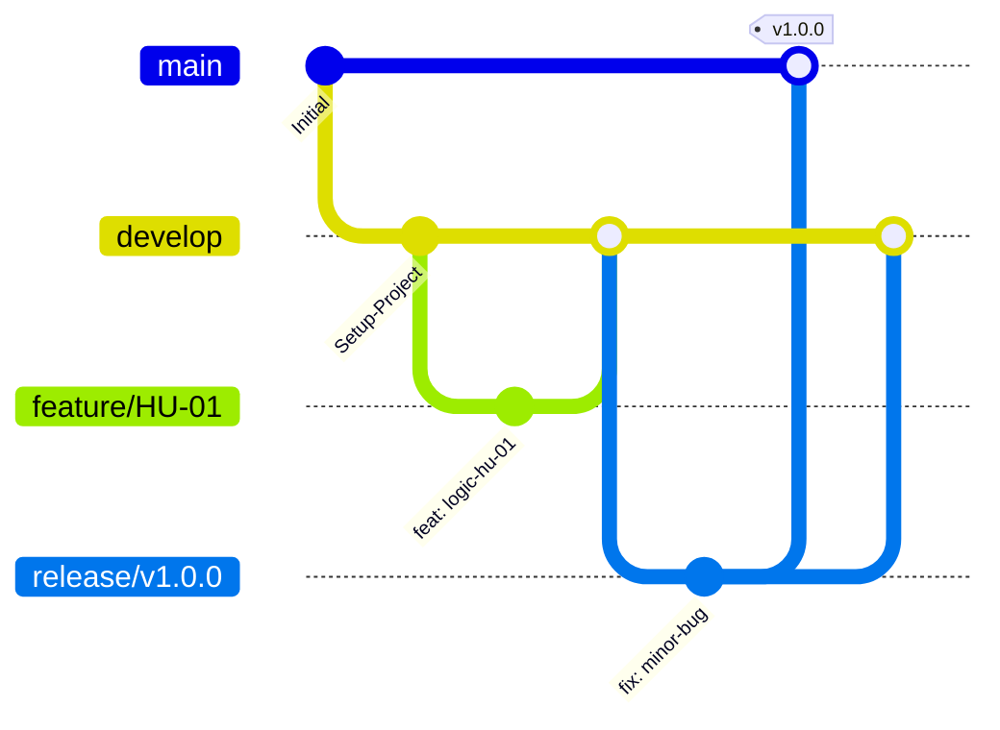

# AgroValle Connect

> El badge de build refleja el pipeline de GitHub Actions definido en `.github/workflows/ci.yml`.

## Visión del Producto

> Para **los productores del Valle del Cauca**, que **necesitan vender directo sin intermediarios excesivos**, **AgroValle Connect** es **una plataforma web desarrollada en Java 17 / Spring Boot** que **conecta la oferta agrícola de las fincas del Valle con la demanda comercial urbana de Cali a precio justo**. A diferencia de **los intermediarios tradicionales**, nuestro producto **garantiza trazabilidad del despacho y contratos de API transparentes entre productor y comprador**.

### El problema

El Valle del Cauca es una despensa agrícola con municipios de alta vocación agrícola como Dagua, Palmira, Buga, Tuluá, Caicedonia y Jamundí, pero la cadena de comercialización tradicional tiene fallas estructurales: intermediación excesiva que baja el precio al productor y lo sube al comprador final, falta de visibilidad en tiempo real de lo que se está cosechando, y ausencia de trazabilidad y programación logística en los despachos.

**AgroValle Connect** elimina la intermediación innecesaria, conectando directamente la oferta agrícola de las fincas del Valle del Cauca con la demanda comercial urbana de Cali y sus alrededores.

### Módulos principales

- **Productores y Ofertas**: registro de fincas por municipio y publicación de cosechas disponibles (cantidad, precio, categoría, fecha estimada de recolección).
- **Catálogo y Búsqueda Inteligente**: filtrado de la oferta por municipio de origen y disponibilidad.
- **Pedidos Directos y Stock**: reserva de inventario, carrito de compra y órdenes de compra directas.
- **Logística y Trazabilidad**: confirmación de alistamiento y seguimiento en tiempo real del despacho.

## Integrantes del equipo

- Shalom Sofia Vargas Muñoz
- Yeison Andres Cifuentes Reina
- Jadith Milena Saenz Magallanes
- Kevin Andres Balanta Mezu

## Stack Tecnológico

- **Backend**: Java 17, Spring Boot, Maven
- **Base de datos**: PostgreSQL
- **Arquitectura**: patrón MVC (/models, /views, /controllers)
- **Calidad**: Checkstyle (Google Java Style), JUnit 5 + JaCoCo (cobertura mínima 60%)
- **Automatización**: Husky (pre-commit hooks)

## Estrategia de Ramas: GitFlow

Elegimos **GitFlow** porque el proyecto está pensado para entregas versionadas a lo largo del curso (incrementos funcionales por sesión) y no para despliegue continuo diario. GitFlow nos da ramas aisladas por funcionalidad y por release, lo que:

- Permite trabajar varias Historias de Usuario en paralelo (una rama `feature/` por HU) sin que el trabajo incompleto de un integrante bloquee a los demás.
- Facilita el control de calidad: cada `feature` pasa por Pull Request y Code Review antes de integrarse a `develop`, y cada `release` se estabiliza antes de llegar a `main`.
- Da trazabilidad clara del historial mediante tags de versión (`v1.0.0`, etc.), útil para la entrega y evaluación de cada incremento.

El costo de GitFlow —mayor complejidad de ramas y posible acumulación de deuda si una rama vive demasiado tiempo— lo mitigamos manteniendo las ramas `feature/` de corta duración y sincronizando frecuentemente con `develop`.

## Convención de Commits

Usamos [Conventional Commits](https://www.conventionalcommits.org/) ligados a Versionamiento Semántico:

- `feat:` nueva funcionalidad (incrementa MINOR)
- `fix:` corrección de error (incrementa PATCH)
- `docs:` / `style:` / `refactor:` / `test:` / `chore:` no afectan la versión pública
- `BREAKING CHANGE:` cambio que rompe compatibilidad (incrementa MAJOR)

Ejemplo: `feat(estudiantes): implementar logica de validacion de correo institucional`

## Calidad y Automatización

Husky y Checkstyle reducen la deuda técnica antes de escribir lógica de negocio: el hook `.husky/pre-commit` ejecuta `./mvnw test` y `./mvnw checkstyle:check` en cada commit. El workflow `.github/workflows/ci.yml` ejecuta `./mvnw verify` en cada cambio de `main` y en cada Pull Request; además, JaCoCo exige una cobertura mínima del 60%.

Para activar Husky localmente, cada integrante debe ejecutar `npm install` desde la raíz del repositorio.
